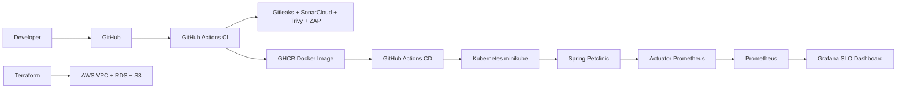

# Proyecto DevOps - Spring Petclinic

Proyecto integrador para disenar e implementar una estrategia DevOps sobre Spring Petclinic.

## Arquitectura



## Componentes

- `app/`: aplicacion Spring Boot, Dockerfile multi-stage y tests.
- `.github/workflows/ci.yml`: build, tests, cobertura, SAST, SCA, DAST y push de imagen.
- `.github/workflows/cd.yml`: despliegue automatico a staging y produccion con aprobacion.
- `k8s/`: manifests de namespace, deployment, service, hpa, pdb, ingress, configmap y secret.
- `terraform/`: IaC AWS con backend remoto S3 y bloqueo DynamoDB.
- `monitoring/`: Prometheus, alertas, ServiceMonitor y dashboard Grafana.
- `security/`: reporte DevSecOps, manejo de secretos y politica ZAP.
- `docs/`: metricas DORA, post-mortem y evidencias.

## Pipeline CI/CD

El CI se ejecuta en `main` y `develop`:

1. Gitleaks revisa secretos.
2. Maven ejecuta build, tests y gate de cobertura JaCoCo >= 80%.
3. SonarCloud ejecuta analisis SAST/calidad.
4. Trivy revisa filesystem y falla con CVEs criticos.
5. OWASP ZAP ejecuta baseline DAST contra la app local.
6. Docker Buildx publica la imagen en GHCR solo en eventos `push`.

El CD se dispara cuando el CI termina correctamente sobre `develop` o manualmente con `workflow_dispatch`.
Staging se despliega automaticamente. Produccion usa GitHub Environments para aprobacion manual.

## Ejecucion local

```bash
cd app
mvn clean verify
mvn spring-boot:run
```

## Docker

```bash
docker build -t spring-petclinic-devops:local app
docker run --rm -p 8080:8080 spring-petclinic-devops:local
```

## Kubernetes

```bash
kubectl apply -f k8s/namespace.yaml
kubectl apply -f k8s/configmap.yaml -n staging
kubectl apply -f k8s/secret.yaml -n staging
kubectl apply -f k8s/deployment.yaml -n staging
kubectl apply -f k8s/service.yaml -n staging
kubectl apply -f k8s/hpa.yaml -n staging
kubectl apply -f k8s/pdb.yaml -n staging
kubectl apply -f k8s/ingress-staging.yaml
kubectl rollout status deployment/spring-petclinic -n staging
```

## Observabilidad

```bash
cd monitoring
docker compose up -d
```

- Prometheus: http://localhost:9090
- Grafana: http://localhost:3000

## Terraform

```bash
cd terraform
terraform init -backend-config=backend.hcl
terraform fmt -recursive
terraform validate
terraform plan
```

Copiar `backend.hcl.example` como `backend.hcl` y configurar el bucket S3 y tabla DynamoDB del estado remoto.

## Checklist de la rubrica

| Requisito | Estado |
|---|---|
| CI/CD completo | Implementado |
| IaC con Terraform | Implementado |
| Kubernetes manifests | Implementado |
| Observabilidad Prometheus/Grafana | Implementado |
| DevSecOps integrado | Implementado |
| Metricas DORA | Documentado |
| Post-mortem blameless | Documentado |
